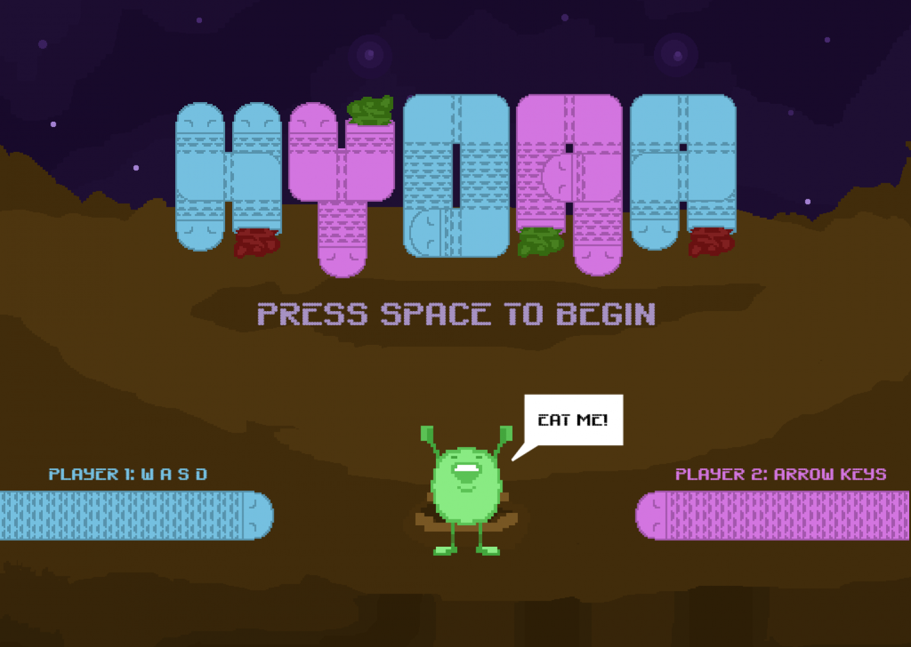
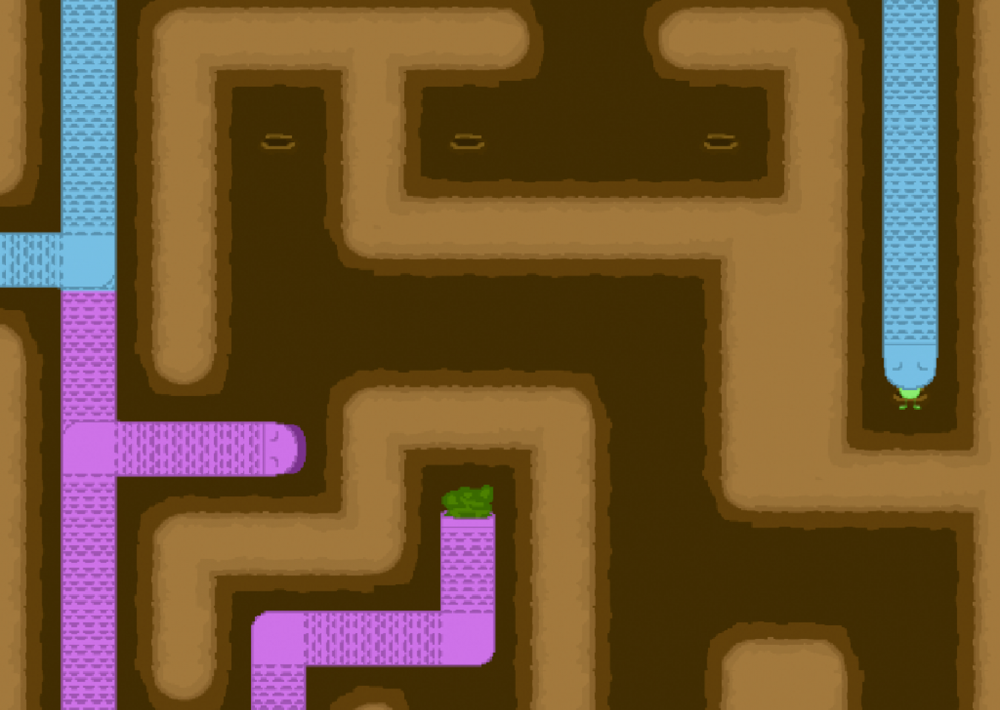
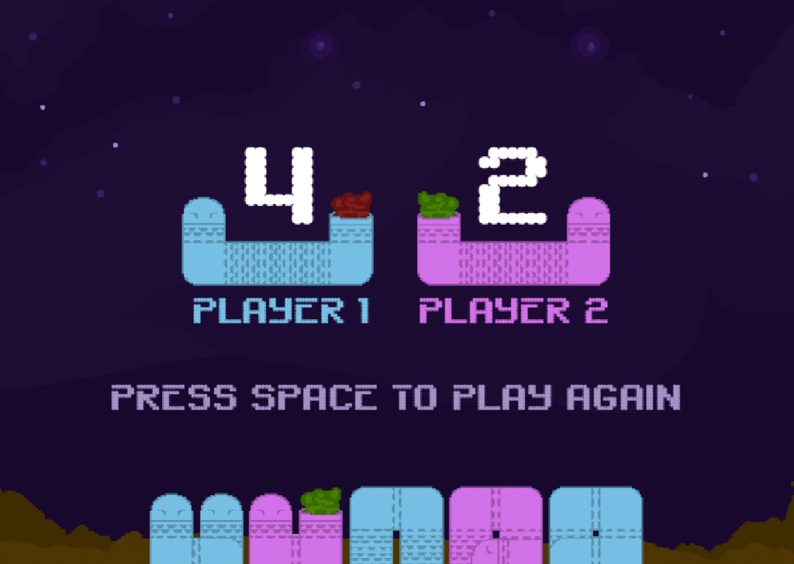

# Hydra

A mini-game for [Global Game Jam 2015](http://globalgamejam.org/) made in 48 hours.

  

__[PLAY HERE](http://shaunlebron.github.io/hydra)__

Instructions:

- Each player controls a colored head
- Dead-ends cause you to die and respawn randomly.
- First head to eat the green man wins.

## Details

The Global Game Jame 2015 theme was "What do we do now?".

We imagined a [Hydra] doesn't have to make decisions in a maze if it can spawn
heads to purse all paths.

We used the [Phaser] game engine in Javascript.

[Hydra]: http://en.wikipedia.org/wiki/Lernaean_Hydra
[Phaser]: http://phaser.io
